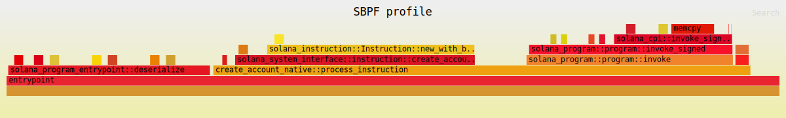

## Profiling Solana Programs

The goal of this project is to profile Solana programs and gain a better
understanding of how to optimize Anchor programs. While this is not a 
comprehensive analysis, it does give us a good starting point for optimizing
Anchor programs.

The Pinocchio program is not a 1:1 comparison, but it demonstrates
account creation with minimal overhead while maintaining essential security
checks. While not necessarily optimal, it serves as a baseline for low-level
performance.

We used the SBPF profiler to create flamegraphs of each program. You can
reproduce these results on your own machine by following these steps:

**Prerequisites:**
- Solana CLI version ≥ 2.3.0

```bash
# Anchor Program
cd anchor
cargo build-sbf
SBPF_PROFILE=/FULL-PATH/profile/target/sbpf-solana-solana/release/profile.so \
  cargo test -p profile -- --nocapture

# Pinocchio Program
cd ../pinocchio
cargo build-sbf
SBPF_PROFILE=/FULL-PATH/target/sbpf-solana-solana/release/pinocchio_create_account.so \
  cargo test -p pinocchio-create-account -- --nocapture

# Native Program
cd ../native
cargo build-sbf
SBPF_PROFILE=/FULL-PATH/target/sbf-solana-solana/release/create_account_native.so \
  cargo test -p create_account_native -- --nocapture
```

The flamegraphs will be saved in each program's
`target/sbpf-solana-solana/release` directory.

## Performance Comparison

| Program Type | Compute Units | % vs Native | % vs Pinocchio |
|--------------|--------------|-------------|----------------|
| **Pinocchio** | **1,526** | **-48.4%** | **-** |
| Native | 2,959 | - | +93.9% |
| Anchor | 4,503 | +52.2% | +195.2% |

## Flamegraph Analysis

### Anchor Flamegraph


The Anchor program flamegraph reveals significant overhead. There is
substantial time spent in `entrypoint::deserialize` and serialization before
executing the CPI. The `entrypoint::deserialize` alone consumes 28% of the
total compute—nearly 3x the compute of the entire Pinocchio program.

### Native Flamegraph



The native program flamegraph is much simpler. While it shares a similar
structure to the Anchor program, the compute usage is significantly lower.
The `entrypoint::deserialize` still consumes a notable portion of compute,
but there is less overhead from account processing and fewer unnecessary
validation checks.

### Pinocchio Flamegraph


The Pinocchio flamegraph is strikingly minimal compared to Anchor and Native
flamegraphs. Pinocchio provides just the essential entrypoint functionality 
with minimal overhead instead of a full framework.

## Conclusion

Anchor remains an excellent choice for building Solana programs, offering a
fully-featured framework with built-in security guarantees and
developer-friendly abstractions. However, this analysis reveals a significant
performance trade-off:

- **Anchor**: Best developer experience, highest overhead (4,503 CU)
- **Native**: Solana-program entrypoint (2,959 CU)
- **Pinocchio**: Maximum performance, minimal abstractions, new entrypoint 
  (1,526 CU)

