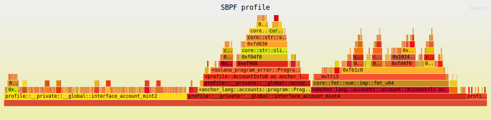
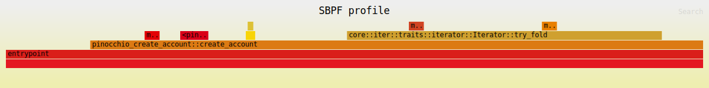

## Profiling Solana Programs

The goal of this project was to profile Solana programs and have a better
understanding of how to improve Anchor programs. The Anchor program in this 
repository has historically been used to benchmark the performance of various
macros built into Anchor.

The Pinocchio program is not a 1:1 compairson, but it is an example of 
creating an account and doing a few security checks after the fact. In no way
is the Pinocchio program optimal, as it was simply vibe-coded into existence.

We used the sbpf-profiler to create flamegraphs of each program. You can do the
same on your own machine by doing the following:

Solana cli required: >=`2.3.0`

```bash
cd anchor
cargo build-sbf
cd ../pinocchio
cargo build-sbf
cd ..
SBPF_PROFILE=/FULL-PATH/anchor/profile/target/sbpf-solana-solana/release/profile.so cargo test -p profile -- --nocapture
SBPF_PROFILE=/FULL-PATH/pinocchio/target/sbpf-solana-solana/release/pinocchio_create_account.so cargo test -p pinocchio-create-account -- --nocapture
```

The flamegraphs will be saved in each program's `target/sbpf-solana-solana/release`
directory.

### Anchor Flamegraph



### Pinocchio Flamegraph

