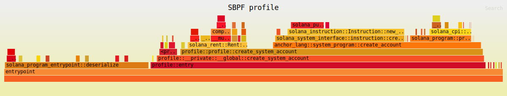

## Profiling Solana Programs

The goal of this project was to profile Solana programs and have a better
understanding of how to improve Anchor programs. The Anchor program in this 
repository has historically been used to benchmark the performance of various
macros built into Anchor.

The Pinocchio program is not a 1:1 compairson, but it is an example of 
creating an account and doing a few security checks after the fact. In no way
is the Pinocchio program optimal, as it was simply vibe-coded into existence.

We used the sbpf-profiler to create flamegraphs of each program. You can do the
same on your own machine by doing the following:

Solana cli required: >=`2.3.0`

```bash
cd anchor
cargo build-sbf
cd ../pinocchio
cargo build-sbf
cd ..
SBPF_PROFILE=/FULL-PATH/anchor/profile/target/sbpf-solana-solana/release/profile.so cargo test -p profile -- --nocapture
SBPF_PROFILE=/FULL-PATH/pinocchio/target/sbpf-solana-solana/release/pinocchio_create_account.so cargo test -p pinocchio-create-account -- --nocapture
```

The flamegraphs will be saved in each program's `target/sbpf-solana-solana/release`
directory.

### Anchor Flamegraph



The Anchor program flamegraph has a lot going on. There is significant time
spent in `entrypoint::deserialize` and serialization before doing the CPI. The 
`entrypoint::deserialize` takes up 28% of the total compute, and nearly 3x the 
compute of the entire Pinocchio program.

### Pinocchio Flamegraph


First thing to note with the Pinocchio flamegraph is that there's not much going
compared to the Anchor flamegraph. This is because the Pinocchio program is
much simpler and doesn't have as many checks as the Anchor program. Not only
that, but Pinocchio is just an entrypoint, not a full framework like Anchor. 

### Conclusion

Anchor is a great tool for most to build Solana programs. It's a fully featured
framework that provides a number of security guarantees out of the box. While
all of this is true, it still has a ways to go to be optimal performance-wise.

